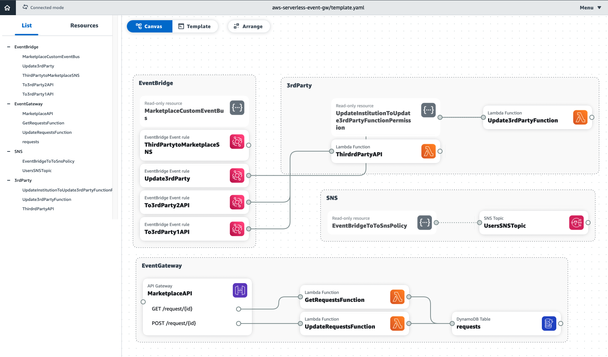

# aws-serverless-event-gw
HOW TO INTEGRATE YOUR AWS EVENT-BASED SYSTEM WITH EXTERNAL/LEGACY SYSTEMS USING RESTFUL API

Read the [Blog Post](https://hacksaw.co.za/blog/using-events-internally-and-apis-externally/)



## How to run it
- [Load template into AWS Application Composer](https://docs.aws.amazon.com/application-composer/latest/dg/using-composer-project.html)
- Use [AWS SAM](https://aws.amazon.com/serverless/sam/) to build and deploy to AWS:

- - Install [AWS CLI](https://docs.aws.amazon.com/cli/latest/userguide/install-cliv2.html), and  [configure it](https://docs.aws.amazon.com/cli/latest/userguide/cli-configure-quickstart.html#cli-configure-quickstart-config)
- - Install [AWS SAM CLI](https://docs.aws.amazon.com/serverless-application-model/latest/developerguide/serverless-sam-cli-install.html)
- To build and deploy your application for the first time, run the following in your shell:

```bash
sam build
sam deploy --guided
```

For future deploys, you can just run:

```bash
sam build && sam deploy
```